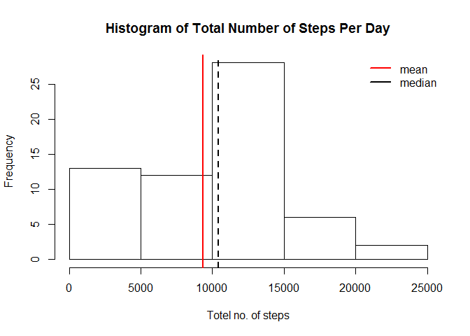
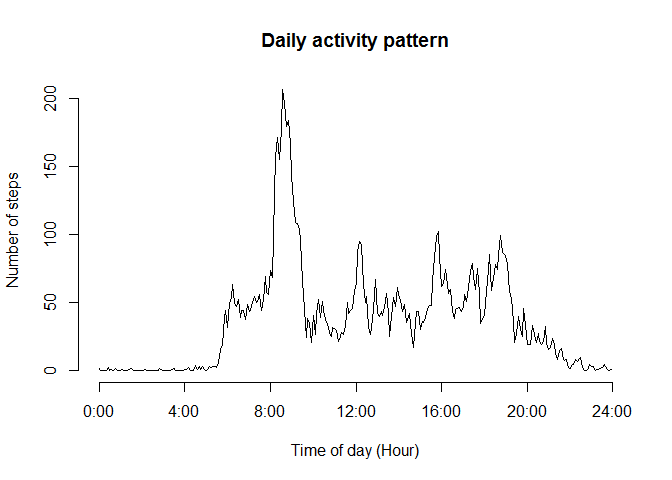
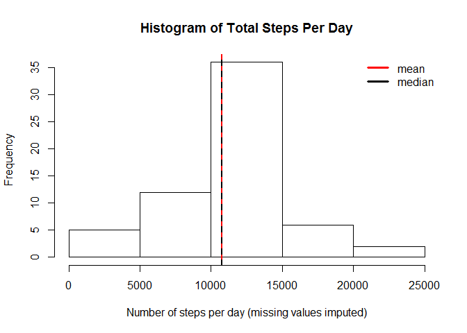
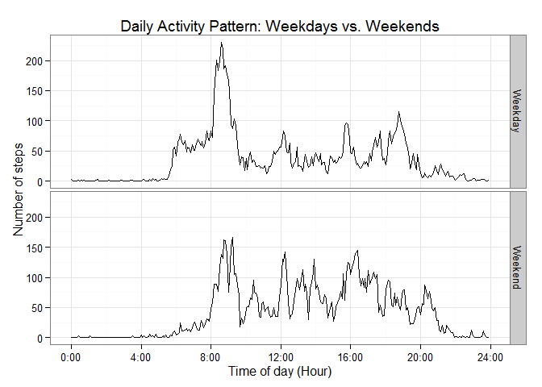

# Reproducible Research: Peer Assessment 1


## Loading and preprocessing the data


```r
activity<-read.csv('activity.csv')
activity$interval <- 60*floor((activity$interval+1)/100) + (activity$interval %% 100)
summary(activity)
```

```
##      steps                date          interval     
##  Min.   :  0.00   2012-10-01:  288   Min.   :   0.0  
##  1st Qu.:  0.00   2012-10-02:  288   1st Qu.: 358.8  
##  Median :  0.00   2012-10-03:  288   Median : 717.5  
##  Mean   : 37.38   2012-10-04:  288   Mean   : 717.5  
##  3rd Qu.: 12.00   2012-10-05:  288   3rd Qu.:1076.2  
##  Max.   :806.00   2012-10-06:  288   Max.   :1435.0  
##  NA's   :2304     (Other)   :15840
```

## What is mean total number of steps taken per day?


We use the following command to calculate the total number of steps taken per day as well as the mean and median of the total number of steps taken per day:

```r
data1<-data.frame(sapply(split(activity$steps,activity$date),sum_RM_NA<-function (x) {sum(x,na.rm=TRUE)}))
colnames(data1)<-'stepsperday'
mean(data1$stepsperday)
```

```
## [1] 9354.23
```

```r
median(data1$stepsperday)
```

```
## [1] 10395
```
The mean and median of the total number of steps taken per day are  9354.23 and 10395, respectively.

The histogram of the total number of steps taken each day is given below with mean and median denoted by the red and blue lines correspondingly. 


```r
hist(data1$stepsperday,main='Histogram of Total Number of Steps Per Day',xlab='Totel no. of steps')
abline(v=mean(data1$stepsperday), col="red", lwd=2)
abline(v=median(data1$stepsperday), col="black", lwd=2,lty=2)
legend(x="topright", legend=c("mean","median"), col=c("red","black"), bty="n", lwd=2)
```

 


## What is the average daily activity pattern?

To generate an average daily activity pattern the mean of each 5-minutes interval over all days is determined using the `tapply` function. The activity pattern is plotted as a time series.


```r
data2<-tapply(activity$steps,activity$interval,mean,na.rm=TRUE)
plot(as.numeric(names(data2)),data2, type="l", axes=F,
     xlab="Time of day (Hour)", ylab="Number of steps",
     main="Daily activity pattern")
axis(2)
axis(1, at=0:6*(4*60), labels=paste(0:6*4,":00", sep=""))
```

 

We use following commands to derive the 5-minute interval that on average contains the maximum number of steps:


```r
max_int <-as.numeric(names(data2[which(data2==max(data2))]))
sprintf("%02d:%02d", floor(max_int/60), max_int  %% 60)
```

```
## [1] "08:35"
```

On average, the maximum number of steps across all the days occurs in the 5-minutes interval starting at 08:35.

## Imputing missing values

Note that there are a number of days/intervals where there are missing values (coded as NA).  

```r
sum(is.na(activity))
```

```
## [1] 2304
```

The data summary statistic tells us that there are 2304 missing values.

As the presence of missing days may introduce bias into data analysis, We use the means for the 5-minute intervals to impute the missing values in the dataset.  


```r
dataImputed <- transform(activity, steps=ifelse(is.na(steps), data2, steps))

summary(dataImputed)
```

```
##      steps                date          interval     
##  Min.   :  0.00   2012-10-01:  288   Min.   :   0.0  
##  1st Qu.:  0.00   2012-10-02:  288   1st Qu.: 358.8  
##  Median :  0.00   2012-10-03:  288   Median : 717.5  
##  Mean   : 37.38   2012-10-04:  288   Mean   : 717.5  
##  3rd Qu.: 27.00   2012-10-05:  288   3rd Qu.:1076.2  
##  Max.   :806.00   2012-10-06:  288   Max.   :1435.0  
##                   (Other)   :15840
```
We recalculate the mean and median total number of steps taken per day using the data set with imputed values.

```r
 data3<-tapply(dataImputed$steps, dataImputed$date, sum, na.rm=TRUE)
  mean(data3)
```

```
## [1] 10766.19
```

```r
  median(data3)
```

```
## [1] 10766.19
```
The total steps per day are displayed as a histogram. The mean value of the total number of steps taken per day (1.0766189\times 10^{4}) is highlighted by a vertical red line and the median (1.0766189\times 10^{4}) by a vertical blue line. 

The mean and the median overlap, and the peak of days with no recorded steps is gone. Both values have increased compared to the original data set. The increase of the mean, however, is much stronger.


```r
hist(data3, xlab="Number of steps per day (missing values imputed)", 
     main="Histogram of Total Steps Per Day")
abline(v=mean(data3), col="red", lwd=2)
abline(v=  median(data3), col="black", lwd=2, lty=2)
legend(x="topright", legend=c("mean","median"), col=c("red","black"), bty="n", lwd=3)
```

 

## Are there differences in activity patterns between weekdays and weekends?

We use `weekdays()` function to create a new factor variable with two levels – “weekday” and “weekend” –  to indicate whether a given date is a weekday or weekend, and make a panel plot to compare daily Activity patterns.It is observed that peak and morning activity are higher during weekdays than weekends.  


```r
weekday <- factor(weekdays(as.Date(dataImputed$date)) %in% c("星期日","星期六"), labels=c("Weekday","Weekend"), ordered=FALSE)
stepsbyweek<- aggregate(dataImputed$steps, by=list(interval=dataImputed$interval, weekday=weekday), mean)
colnames(stepsbyweek)[3]<-'steps'
library(ggplot2)
g <- ggplot(stepsbyweek, aes(interval/60, steps))
g + geom_line() + facet_grid(weekday ~ .) +
    scale_x_continuous(breaks=0:6*4, labels=paste(0:6*4,":00", sep="")) +
    theme_bw() +
    labs(y="Number of steps") +
    labs(x="Time of day (Hour)") +
    labs(title="Daily Activity Pattern: Weekdays vs. Weekends")
```

 


